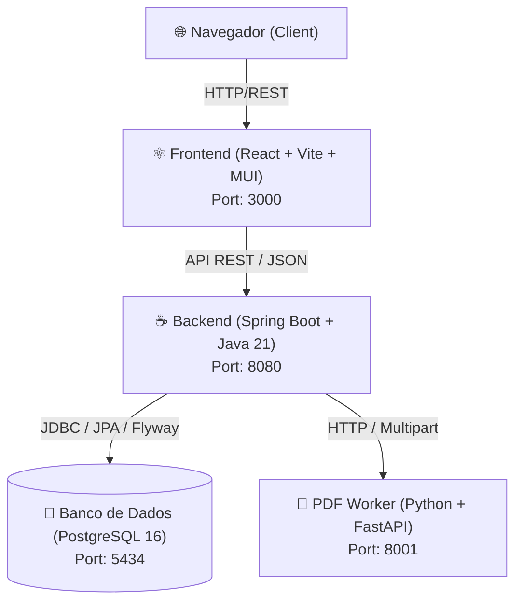

# 🎯 Olha Minha Questão

> Plataforma completa e moderna para gerenciamento, resolução de questões, execução de simulados e análise de desempenho em concursos públicos e vestibulares.

---

## 📌 Sobre o Projeto

O **Olha Minha Questão** é um ecossistema projetado para otimizar a preparação para exames, concursos e vestibulares. A plataforma combina um frontend moderno e intuitivo em **React/TypeScript**, um backend robusto e escalável em **Spring Boot (Java 21)** e um microsserviço dedicado de extração em **Python** para processamento automático de cadernos de provas e gabaritos oficiais em PDF.

Além da resolução de questões com filtros avançados, o sistema oferece **Lousa de Rascunho interativa** por questão, **simulados temporizados com modo foco**, **cálculo dinâmico de estatísticas de desempenho**, **organização por pastas/cadernos**, **exportação de resultados em CSV** e **gestão completa de perfil**.

---

## ✨ Principais Funcionalidades

### 📚 Banco de Questões e Filtros
- Navegação e busca dinâmica por **Banca/Origem**, **Área de Conhecimento**, **Disciplina/Matéria**, **Ano** e **Dificuldade**.
- Suporte a **Textos de Referência** compartilhados entre questões com visualizador em *Drawer* e busca rápida.
- Exibição com formatação rica, suporte a imagens em enunciados e alternativas.

### ⏱️ Simulados & Modo Prova
- Realização de provas completas com cronômetro integrado e controle de tempo.
- **Alternância de Visualização**:
  - *Modo Completo*: visualização de todas as questões em sequência.
  - *Modo Foco*: questão por questão, ideal para concentração e simulados individuais.
- Finalização com cálculo automático de acertos, erros e percentual de aproveitamento.
- **Exportação CSV**: download dos resultados detalhados contendo questão, acerto, alternativa marcada e gabarito oficial.

### 🎨 Lousa Interativa de Raciocínio (Whiteboard)
- Canvas de desenho integrado diretamente em cada questão.
- Ferramentas de caneta, espessura, seletor de cores, borracha e limpeza.
- Persistência das anotações e desenhos no backend em formato Base64 para consulta posterior.

### 📊 Painel de Estatísticas & Desempenho
- **Landing Page Interativa**: contadores em tempo real de questões cadastradas, provas disponíveis e usuários ativos.
- **Dashboard do Usuário**:
  - Taxa de acerto global e segmentada por área/disciplina.
  - Análise de dificuldade e precisão das respostas.
  - Histórico detalhado de todos os simulados realizados com revisão questão por questão.

### 📁 Pastas e Cadernos de Estudos
- Criação de pastas personalizadas para organizar questões favoritas, pontos de atenção ou cadernos de erros.
- Pastas específicas para agrupamento de provas e simulados.

### 📄 Extração Automatizada de PDFs (Worker)
- Microsserviço Python inteligente com **FastAPI** e **PyMuPDF (fitz)**.
- Extração de enunciados, alternativas e textos associados com expressões regulares tolerantes a variações de layout.
- Processamento e associação automática de gabaritos em PDF.

### 👤 Gestão de Usuários & Segurança
- Controle de acesso baseado em papéis (`ADMIN` e `GENERAL`).
- Painel de edição de perfil: alteração de nome, e-mail e redefinição de senha com validação segura de credenciais.

---

## 🏗️ Arquitetura do Sistema



---

## 🛠️ Tecnologias Utilizadas

### Frontend
- **React 18** com **TypeScript**
- **Vite** (Build tool e servidor de desenvolvimento)
- **Material UI (MUI v6)** & Emotion (Interface, temas e componentes)
- **React Router v7** (Roteamento SPA)
- **Axios** (Comunicação HTTP com interceptores)

### Backend
- **Java 21**
- **Spring Boot 4.x** (Web MVC, Data JPA, Validation)
- **Flyway** (Versionamento e controle de migrações do banco de dados)
- **MapStruct & Lombok** (Mapeamento performático de DTOs e boilerplate reduction)
- **Tomcat Embutido**

### Worker de PDF
- **Python 3.11+**
- **FastAPI** & **Uvicorn**
- **PyMuPDF (fitz)** para parsing vetorial de PDFs
- **Pydantic** para validação de dados

### Banco de Dados & Infraestrutura
- **PostgreSQL 16**
- **Docker** & **Docker Compose**
- **Nginx** (servindo o build de produção no container frontend)

---

## 🚀 Como Executar

### Pré-requisitos
- [Docker](https://docs.docker.com/get-docker/) e [Docker Compose](https://docs.docker.com/compose/) instalados.
- *(Opcional)* `make` para executar os comandos automatizados via [Makefile](file:///home/felkng/Documents/personal_projects/olha_minha_questao/Makefile).

---

### Executando com Docker (Recomendado)

1. **Clone o repositório:**
   ```bash
   git clone https://github.com/Felkng/Olha-minha-questao.git
   cd Olha-minha-questao
   ```

2. **Inicie os serviços:**
   ```bash
   make up
   # ou: docker compose up -d
   ```

3. **Popule o banco com dados iniciais (Seed):**
   ```bash
   make seed
   # ou: docker compose exec -T db psql -U postgres -d olha_minha_questao < backend/src/main/resources/db/seed.sql
   ```

4. **Acesse as aplicações:**
   - **Frontend:** [http://localhost:3000](http://localhost:3000)
   - **Backend API:** [http://localhost:8080](http://localhost:8080)
   - **PDF Worker Docs:** [http://localhost:8001/docs](http://localhost:8001/docs)

---

### ⚙️ Comandos do Makefile

| Comando | Descrição |
| :--- | :--- |
| `make up` | Inicia todos os serviços em segundo plano via Docker |
| `make down` | Para e remove os contêineres Docker |
| `make build` | Reconstrói as imagens e reinicia os serviços |
| `make logs` | Exibe os logs unificados em tempo real |
| `make status` | Lista o status dos contêineres |
| `make seed` | Executa o script de carga inicial no PostgreSQL |
| `make mvn-test` | Executa a suíte de testes unitários e de integração do backend |
| `make mvn-package` | Gera o artefato `.jar` de produção |
| `make frontend-dev` | Inicia o servidor local do frontend com Hot Reload |
| `make frontend-build`| Compila e valida o build de produção do frontend |

---

## 📂 Estrutura de Diretórios

```
olha_minha_questao/
├── backend/                  # Aplicação Spring Boot (Java 21)
│   ├── src/main/java/        # Código-fonte (Controllers, Services, Repositories, DTOs, Mappers)
│   ├── src/main/resources/   # Configurações e migrações Flyway (V1..V64, seed.sql)
│   ├── src/test/             # Testes automatizados e PDFs de exemplo
│   ├── Dockerfile            # Multi-stage Docker build do Spring Boot
│   └── pom.xml               # Dependências Maven
├── frontend/                 # Aplicação React (TypeScript + Vite + MUI)
│   ├── src/
│   │   ├── components/       # Componentes modulares (CRUDs, Lousa, Simulados, Landing, etc.)
│   │   ├── pages/            # Páginas e roteamento da aplicação
│   │   ├── services/         # Clientes de API e comunicação HTTP
│   │   ├── theme/            # Definições de tema e paleta de cores
│   │   └── types/            # Interfaces e tipos TypeScript
│   ├── Dockerfile            # Multi-stage build com Nginx
│   └── package.json          # Dependências Node.js
├── pdfReaderWorker/          # Microsserviço de processamento de PDFs (Python + FastAPI)
│   ├── parser.py             # Algoritmos de extração e parsing de questões/gabaritos
│   ├── main.py               # Endpoints FastAPI
│   └── Dockerfile            # Container Python
├── docker-compose.yml        # Orquestração dos 4 serviços
├── Makefile                  # Atalhos para comandos frequentes
└── README.md                 # Documentação do projeto
```

---

## 📡 Principais Endpoints da API

| Método | Endpoint | Descrição |
| :--- | :--- | :--- |
| `POST` | `/api/v1/auth/login` | Autenticação de usuário |
| `POST` | `/api/v1/auth/register` | Cadastro de novos usuários |
| `GET` | `/api/v1/users/{id}` | Perfil e dados consolidados do usuário |
| `PUT` | `/api/v1/users/{id}` | Atualização de dados cadastrais (nome, e-mail, senha) |
| `GET` | `/api/v1/questions` | Listagem paginada de questões com filtros dinâmicos |
| `POST` | `/api/v1/questions` | Criação manual de questões |
| `POST` | `/api/v1/questions/{id}/answers` | Submissão de resposta individual |
| `GET` | `/api/v1/tests` | Listagem de provas e simulados |
| `GET` | `/api/v1/tests/{id}/evaluation` | Modo simulado com questões e texto de referência |
| `POST` | `/api/v1/tests/{id}/attempts` | Submissão e avaliação de simulado completo |
| `GET` | `/api/v1/tests/attempts/{id}` | Detalhes e correção completa de uma tentativa |
| `GET` | `/api/v1/statistics/landing` | Métricas públicas consolidadas para a landing page |
| `GET` | `/api/v1/folders` | Gerenciamento de pastas de questões e provas |
| `GET` | `/api/v1/questions/{id}/board` | Consulta da lousa de raciocínio da questão |
| `PUT` | `/api/v1/questions/{id}/board` | Salvamento dos traços da lousa de raciocínio |

---

## 📄 Licença

Este projeto está sob a licença [MIT](LICENSE).
